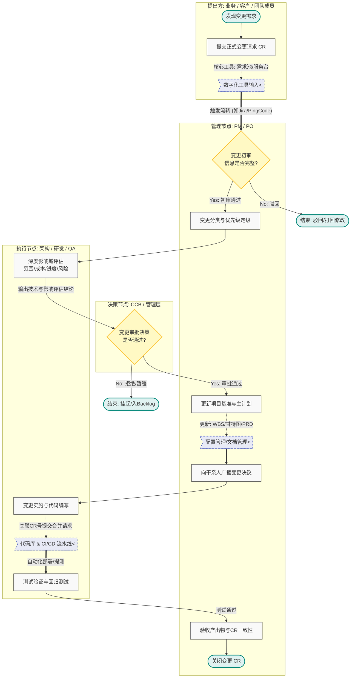

# 变更管理流程图

以下为典型的研发变更管理流程，可用于项目团队、PM/PO、研发与测试以及 CCB / 管理层之间的协同。流程图采用 Mermaid 语法描述。

```mermaid
flowchart TD
    %% 样式定义
    classDef process fill:#f9f9f9,stroke:#333,stroke-width:1px,color:#333
    classDef decision fill:#fff9c4,stroke:#fbc02d,stroke-width:2px,color:#333
    classDef terminal fill:#e0f2f1,stroke:#00897b,stroke-width:2px,color:#333
    classDef toolchain fill:#e8eaf6,stroke:#3f51b5,stroke-width:1px,stroke-dasharray: 5 5,color:#333

    %% 提出人泳道
    subgraph Initiator [提出方: 业务 / 客户 / 团队成员]
        direction TB
        A([发现变更需求]) --> B[提交正式变更请求 CR]
        B -. "核心工具: 需求池/服务台" .-> B_Tool>数字化工具输入<]
        class B_Tool toolchain
    end

    %% PM/PO 泳道
    subgraph PM_PO [管理节点: PM / PO]
        direction TB
        C{变更初审\n信息是否完整?}
        D[变更分类与优先级定级]
        I[更新项目基准与主计划]
        J[向干系人广播变更决议]
        N[验收产出物与CR一致性]
        O([关闭变更 CR])
        
        I -. "更新: WBS/甘特图/PRD" .-> I_Tool>配置管理/文档管理<]
        class I_Tool toolchain
    end

    %% 研发与测试团队泳道
    subgraph Tech_Team [执行节点: 架构 / 研发 / QA]
        direction TB
        E[深度影响域评估\n范围/成本/进度/风险]
        K[变更实施与代码编写]
        M[测试验证与回归测试]
        
        K -. "关联CR号提交合并请求" .-> K_Tool>代码库 & CI/CD 流水线<]
        class K_Tool toolchain
    end

    %% CCB / 管理层泳道
    subgraph CCB_Board [决策节点: CCB / 管理层]
        direction TB
        F{变更审批决策\n是否通过?}
    end

    %% 跨泳道流程连线
    B_Tool ==> |"触发流转 (如Jira/PingCode)"| C
    C -- "No: 驳回" --> Z1([结束: 驳回/打回修改])
    C -- "Yes: 初审通过" --> D
    D --> E
    E -- "输出技术与影响评估结论" --> F
    F -- "No: 拒绝/暂缓" --> Z2([结束: 挂起/入Backlog])
    F -- "Yes: 审批通过" --> I
    I_Tool ==> J
    J --> K
    K_Tool ==> |"自动化部署/提测"| M
    M -- "测试通过" --> N
    N --> O

    %% 应用样式
    class A,O,Z1,Z2 terminal
    class C,F decision
    class B,D,E,I,J,K,M,N process
```
