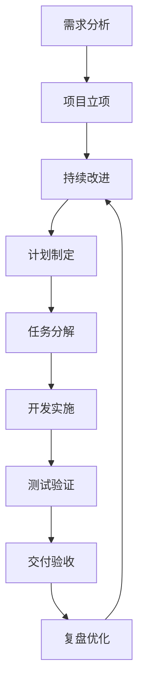

# 研发项目管理流程图空间

本文件为研发项目管理流程图空间，展示典型研发项目从启动到交付的标准流程，并提供各阶段说明，方便团队统一管理与协作。

## 流程图

## 阶段说明

1. 需求分析：梳理业务目标、用户需求、项目范围。
2. 项目立项：明确项目背景、目标、责任人、预算与时间节点。
3. 需求评审：组织需求评审会议，确认需求可行性与优先级。
4. 计划制定：制定迭代计划、资源计划、里程碑与风险应对方案。
5. 任务分解：将计划拆解为具体开发、测试、设计等任务。
6. 开发实施：根据任务执行开发工作，并保持与产品、测试的沟通。
7. 测试验证：进行功能测试、回归测试和验收测试，保证交付质量。
8. 交付验收：完成项目交付，进行验收并正式上线或归档。
9. 复盘优化：总结经验教训，优化流程，为后续项目提供改进建议。

## 使用说明

- 该流程图空间适用于软件研发、技术项目和产品开发。
- 可根据实际项目特点调整阶段名称、节点顺序和输出成果。
- 建议将该文档作为团队项目管理规范的一部分，定期迭代与补充。
